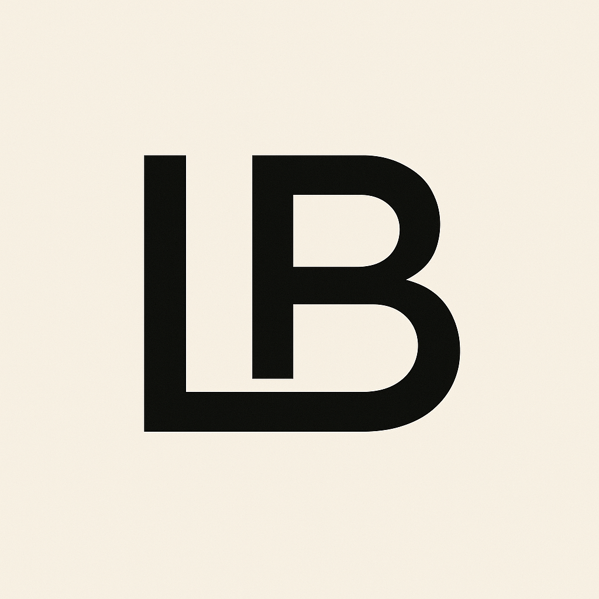

# 🚀 Luis Brito - Portfolio

<div align="center">
  
  
  ### SDET | Quality Assurance Engineer
  
  [](https://nextjs.org/)
  [](https://reactjs.org/)
  [](https://www.typescriptlang.org/)
  [](https://tailwindcss.com/)
</div>

---

## ✨ Features

- 🎨 **Modern Design** - Sleek UI with gradient effects and smooth animations
- 🌈 **Interactive Elements** - Glow effects that follow your cursor
- 📱 **Fully Responsive** - Perfect on all devices
- ⚡ **Fast Performance** - Built with Next.js 16 and Turbopack
- 🎭 **Smooth Animations** - Beautiful transitions and hover effects

## 🛠️ Tech Stack

- **Framework**: Next.js 16
- **Language**: TypeScript
- **Styling**: Tailwind CSS v4
- **Icons**: Lucide React
- **Animation**: Framer Motion

## 🚀 Getting Started

### Prerequisites

- Node.js >= 20.9.0
- npm or yarn

### Installation

```bash
# Clone the repository
git clone https://github.com/yourusername/my-portfolio.git

# Navigate to the project
cd my-portfolio

# Install dependencies
npm install
```

### Development

```bash
# Run development server
npm run dev

# Clean build (recommended)
npm run dev:clean
```

Open [http://localhost:3000](http://localhost:3000) in your browser.

## 📦 Available Scripts

- `npm run dev` - Start development server
- `npm run dev:clean` - Clean cache and start dev server
- `npm run build` - Build for production
- `npm run start` - Start production server
- `npm run lint` - Run ESLint

## 🎨 Customization

Edit the content in `src/app/page.tsx` to customize:

- Personal information
- Skills and technologies
- Projects showcase
- Contact details

## 📄 License

This project is open source and available under the [MIT License](LICENSE).

---

<div align="center">
  Made with ❤️ by Luis Brito | ISTQB Certified Tester
</div>
